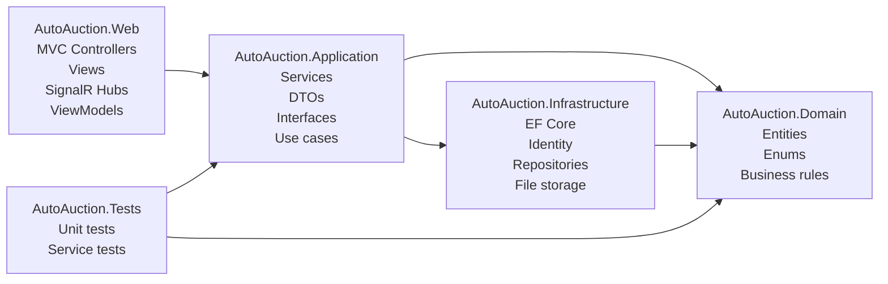
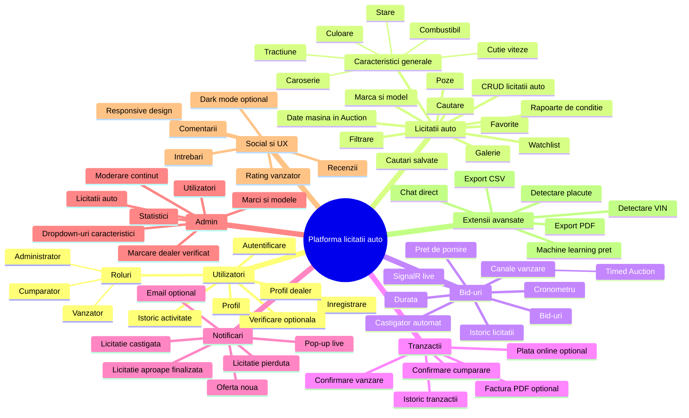
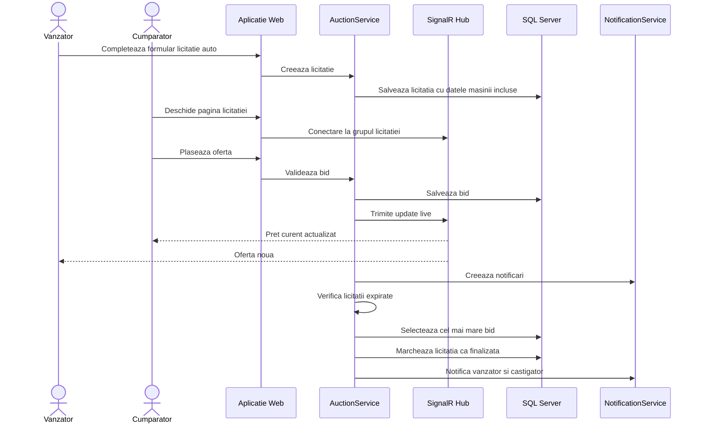
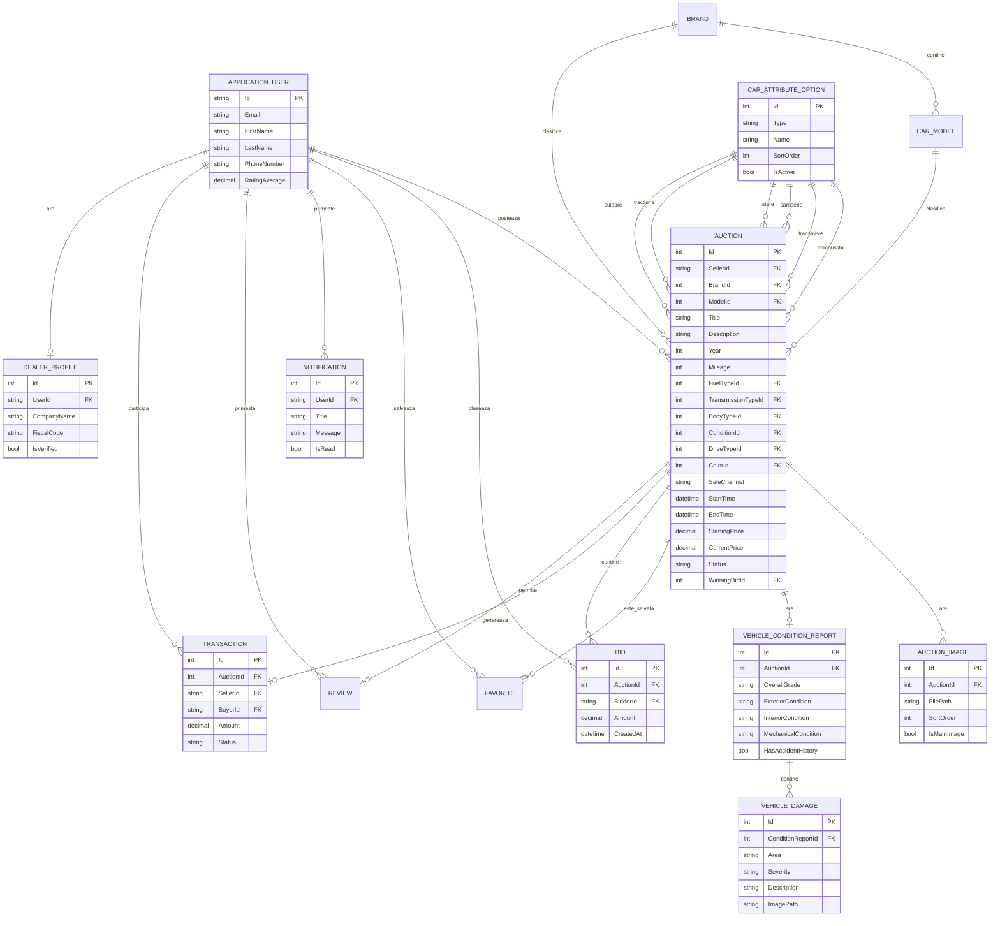
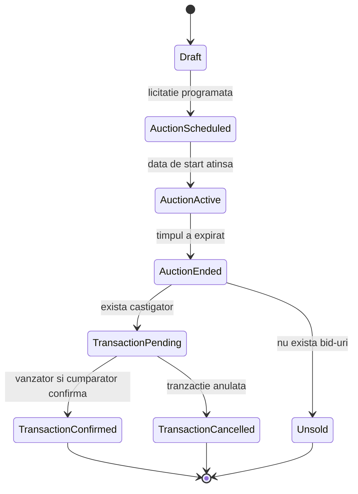
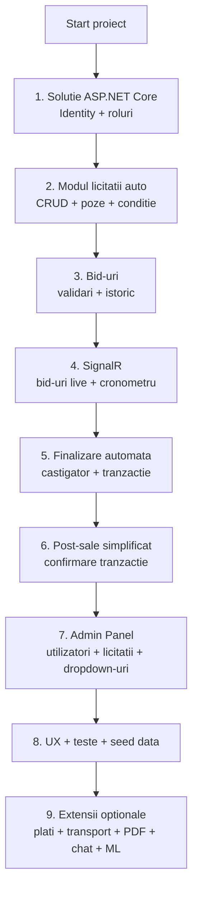

# Diagrama proiectului - Platforma de licitatii auto

## 1. Diagrama generala a sistemului

```mermaid
flowchart TB
    U[Utilizator] --> UI[Interfata Web MVC]

    UI --> AUTH[Autentificare si roluri<br/>ASP.NET Identity]
    UI --> DEALER[Profil dealer simplificat<br/>optional verificat]
    UI --> AUCTIONS[Modul licitatii auto]
    UI --> POSTSALE[Post-sale simplificat<br/>tranzactii]
    UI --> PROFILE[Profil utilizator]
    UI --> ADMIN[Admin Panel]

    AUTH --> ROLES[Roluri<br/>Administrator<br/>Vanzator<br/>Cumparator]

    AUCTIONS --> CREATEAUCTION[Adaugare / editare / stergere licitatie auto]
    AUCTIONS --> VEHICLEDATA[Date masina incluse<br/>in modelul Auction]
    AUCTIONS --> MEDIA[Poze si galerie media]
    AUCTIONS --> SEARCH[Cautare si filtrare]
    AUCTIONS --> BRANDS[Marci si modele]
    AUCTIONS --> ATTRS[Caracteristici generale<br/>dropdown-uri]
    AUCTIONS --> CONDITION[Raport de conditie]
    AUCTIONS --> CHANNELS[Canal vanzare<br/>Timed Auction]
    AUCTIONS --> BID[Plasare oferta]
    AUCTIONS --> LIVE[Actualizare live<br/>SignalR]
    AUCTIONS --> TIMER[Cronometru licitatie]
    AUCTIONS --> WINNER[Stabilire castigator]
    AUCTIONS --> NOTIF[Notificari]

    POSTSALE --> TRANSACTION[Tranzactie post-sale]
    POSTSALE --> STATUS[Status tranzactie<br/>Pending / Confirmed / Cancelled]

    PROFILE --> HISTORY[Istoric licitatii]
    PROFILE --> SELLERCARS[Licitatii postate]
    PROFILE --> RATINGS[Ratinguri si recenzii]
    PROFILE --> FAVORITES[Favorite]

    ADMIN --> USERS[Gestionare utilizatori]
    ADMIN --> ADMINAUCTIONS[Gestionare licitatii auto]
    ADMIN --> ADMINATTRS[Gestionare dropdown-uri<br/>caracteristici auto]
    ADMIN --> DEALERVERIFY[Marcare dealer verificat<br/>optional]
    ADMIN --> STATS[Rapoarte si statistici]
    ADMIN --> MODERATION[Moderare continut]

    UI --> APP[Layer Application<br/>Servicii si reguli]
    APP --> DOMAIN[Layer Domain<br/>Entitati si reguli business]
    APP --> INFRA[Layer Infrastructure]

    INFRA --> DB[(SQL Server)]
    INFRA --> FILES[Stocare imagini<br/>Local / Cloud]
    INFRA --> EMAIL[Email / notificari]
    INFRA --> LOGS[Serilog logs]
```

## 2. Arhitectura pe layere

## 3. Module care se vor implementa

## 4. Fluxul principal al unei licitatii

## 5. Diagrama bazei de date la nivel inalt

## 6. Statusuri importante

## 7. Prioritatea implementarii

